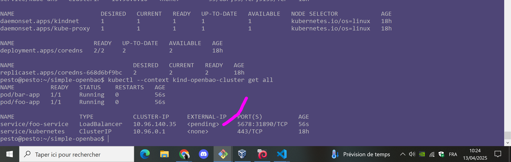

# OpenBAO

## How to provision

### Create Kubernetes Cluster

* Install kind, arkade, kubectl, with scripts, and then run:

```bash
kind create cluster --name openbao-cluster
kubectl cluster-info --context kind-openbao-cluster
kubectl --context kind-openbao-cluster get all
```

* NEXT: <https://kind.sigs.k8s.io/docs/user/loadbalancer/>

```bash
kubectl --context kind-openbao-cluster apply -f ./utils/kind/cloud-provider-kind/example.yaml
```

Result, on a classical machine where you are wifi connected to your internet box, it simply does nto work, just like `metallb`:



## References

* <https://github.com/kubernetes-sigs/cloud-provider-kind>
* <https://kind.sigs.k8s.io/docs/user/loadbalancer/>