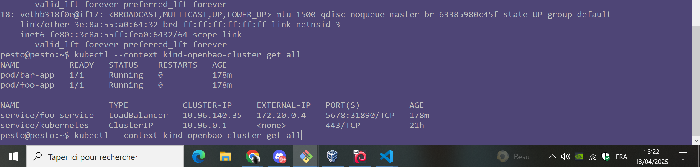

# OpenBAO

## How to provision

### Create Kubernetes Cluster

* Install kind, arkade, kubectl, with scripts, and then run:

```bash
kind create cluster --name openbao-cluster
kubectl cluster-info --context kind-openbao-cluster
kubectl --context kind-openbao-cluster get all
```

* NEXT: <https://kind.sigs.k8s.io/docs/user/loadbalancer/>

```bash

chmod +x ./utils/kind/cloud-provider-kind/provision.cloud.provider.sh

./utils/kind/cloud-provider-kind/provision.cloud.provider.sh

kubectl --context kind-openbao-cluster apply -f ./utils/kind/cloud-provider-kind/example.yaml

kubectl --context kind-openbao-cluster get all
```

Now it works and the load balancer assigns addresses on a docker network (below the `172.20.0.4` ip address):



So now all I need to find out, is how to hit the `172.20.0.4` from outside of the VM.

Here is the ip addr on the VM:

```bash
pesto@pesto:~$ ip addr
1: lo: <LOOPBACK,UP,LOWER_UP> mtu 65536 qdisc noqueue state UNKNOWN group default qlen 1000
    link/loopback 00:00:00:00:00:00 brd 00:00:00:00:00:00
    inet 127.0.0.1/8 scope host lo
       valid_lft forever preferred_lft forever
    inet6 ::1/128 scope host noprefixroute
       valid_lft forever preferred_lft forever
2: enp0s3: <BROADCAST,MULTICAST,UP,LOWER_UP> mtu 1500 qdisc fq_codel state UP group default qlen 1000
    link/ether 08:00:27:32:2d:ed brd ff:ff:ff:ff:ff:ff
    inet 192.168.1.16/24 brd 192.168.1.255 scope global dynamic noprefixroute enp0s3
       valid_lft 73587sec preferred_lft 73587sec
    inet6 2a01:cb14:8341:bb00:31e3:15e6:97ef:45e6/64 scope global temporary dynamic
       valid_lft 86365sec preferred_lft 565sec
    inet6 2a01:cb14:8341:bb00:a00:27ff:fe32:2ded/64 scope global dynamic mngtmpaddr noprefixroute
       valid_lft 86365sec preferred_lft 565sec
    inet6 fe80::a00:27ff:fe32:2ded/64 scope link noprefixroute
       valid_lft forever preferred_lft forever
3: br-632fa95ec479: <BROADCAST,MULTICAST,UP,LOWER_UP> mtu 1500 qdisc noqueue state UP group default
    link/ether 02:42:53:d4:83:49 brd ff:ff:ff:ff:ff:ff
    inet 172.18.0.1/16 brd 172.18.255.255 scope global br-632fa95ec479
       valid_lft forever preferred_lft forever
    inet6 fe80::42:53ff:fed4:8349/64 scope link
       valid_lft forever preferred_lft forever
4: docker0: <NO-CARRIER,BROADCAST,MULTICAST,UP> mtu 1500 qdisc noqueue state DOWN group default
    link/ether 02:42:32:86:76:cb brd ff:ff:ff:ff:ff:ff
    inet 172.17.0.1/16 brd 172.17.255.255 scope global docker0
       valid_lft forever preferred_lft forever
    inet6 fe80::42:32ff:fe86:76cb/64 scope link
       valid_lft forever preferred_lft forever
5: br-ba7e4f9caae1: <NO-CARRIER,BROADCAST,MULTICAST,UP> mtu 1500 qdisc noqueue state DOWN group default
    link/ether 02:42:9a:2e:28:e8 brd ff:ff:ff:ff:ff:ff
    inet 172.19.0.1/16 brd 172.19.255.255 scope global br-ba7e4f9caae1
       valid_lft forever preferred_lft forever
7: vethcde4d26@if6: <BROADCAST,MULTICAST,UP,LOWER_UP> mtu 1500 qdisc noqueue master br-632fa95ec479 state UP group default
    link/ether b6:4d:b9:7f:e6:d4 brd ff:ff:ff:ff:ff:ff link-netnsid 0
    inet6 fe80::b44d:b9ff:fe7f:e6d4/64 scope link
       valid_lft forever preferred_lft forever
8: br-63385980c45f: <BROADCAST,MULTICAST,UP,LOWER_UP> mtu 1500 qdisc noqueue state UP group default
    link/ether 02:42:a2:4c:3f:1f brd ff:ff:ff:ff:ff:ff
    inet 172.20.0.1/16 brd 172.20.255.255 scope global br-63385980c45f
       valid_lft forever preferred_lft forever
    inet6 fc00:f853:ccd:e793::1/64 scope global nodad
       valid_lft forever preferred_lft forever
    inet6 fe80::42:a2ff:fe4c:3f1f/64 scope link
       valid_lft forever preferred_lft forever
10: veth9356688@if9: <BROADCAST,MULTICAST,UP,LOWER_UP> mtu 1500 qdisc noqueue master br-63385980c45f state UP group default
    link/ether 0a:d3:9e:c0:77:86 brd ff:ff:ff:ff:ff:ff link-netnsid 1
    inet6 fe80::8d3:9eff:fec0:7786/64 scope link
       valid_lft forever preferred_lft forever
16: veth9b82103@if15: <BROADCAST,MULTICAST,UP,LOWER_UP> mtu 1500 qdisc noqueue master br-63385980c45f state UP group default
    link/ether 1e:ec:57:2f:2b:53 brd ff:ff:ff:ff:ff:ff link-netnsid 2
    inet6 fe80::1cec:57ff:fe2f:2b53/64 scope link
       valid_lft forever preferred_lft forever
18: vethb318f0e@if17: <BROADCAST,MULTICAST,UP,LOWER_UP> mtu 1500 qdisc noqueue master br-63385980c45f state UP group default
    link/ether 3e:8a:55:a0:64:32 brd ff:ff:ff:ff:ff:ff link-netnsid 3
    inet6 fe80::3c8a:55ff:fea0:6432/64 scope link
       valid_lft forever preferred_lft forever
pesto@pesto:~$ kubectl --context kind-openbao-cluster get all
NAME          READY   STATUS    RESTARTS   AGE
pod/bar-app   1/1     Running   0          178m
pod/foo-app   1/1     Running   0          178m

NAME                  TYPE           CLUSTER-IP     EXTERNAL-IP   PORT(S)          AGE
service/foo-service   LoadBalancer   10.96.140.35   172.20.0.4    5678:31890/TCP   178m
service/kubernetes    ClusterIP      10.96.0.1      <none>        443/TCP          21h
pesto@pesto:~$ kubectl --context kind-openbao-cluster get all

```

Note that the ip address assigned to the kubernetes LoadBalancer, is one IP address in the network of the kind cluster, the docker `kind` network:

```bash
pesto@pesto:~$ docker network ls
NETWORK ID     NAME                              DRIVER    SCOPE
d593d89fdf04   bridge                            bridge    local
cbecae968382   host                              host      local
63385980c45f   kind                              bridge    local
ba7e4f9caae1   minio_terraform_backend_default   bridge    local
dd87d1143de7   none                              null      local
632fa95ec479   pesto-api_pesto_net               bridge    local
pesto@pesto:~$ docker network inspect kind
[
    {
        "Name": "kind",
        "Id": "63385980c45fd4d673c551ad0c41f3f13c534d033d0b2e3a90f9a242f3c4ec49",
        "Created": "2025-04-12T15:28:37.555145467+02:00",
        "Scope": "local",
        "Driver": "bridge",
        "EnableIPv6": true,
        "IPAM": {
            "Driver": "default",
            "Options": {},
            "Config": [
                {
                    "Subnet": "fc00:f853:ccd:e793::/64"
                },
                {
                    "Subnet": "172.20.0.0/16",
                    "Gateway": "172.20.0.1"
                }
            ]
        },
        "Internal": false,
        "Attachable": false,
        "Ingress": false,
        "ConfigFrom": {
            "Network": ""
        },
        "ConfigOnly": false,
        "Containers": {
            "68e84dfa8bdbd0778100e6ca012c6966242b231dbaa9e98215cc965ebc1a875e": {
                "Name": "kindccm-abe180f8aecd",
                "EndpointID": "96b6c8356417538710249fad4fe7363f6cbb35036577bef818423a1b4be997a8",
                "MacAddress": "02:42:ac:14:00:04",
                "IPv4Address": "172.20.0.4/16",
                "IPv6Address": "fc00:f853:ccd:e793::4/64"
            },
            "7a18e8cb579a8381ca6cc15d8aee59f6427e9d84a1ce0099ffdb20243cc683cf": {
                "Name": "run-cloud-provider-1",
                "EndpointID": "3a877fd921531989152a3365b91c68874c0f8824468a492ae5e98c852279016d",
                "MacAddress": "02:42:ac:14:00:03",
                "IPv4Address": "172.20.0.3/16",
                "IPv6Address": "fc00:f853:ccd:e793::3/64"
            },
            "f2c8383045b1e30b9d201fd3896d23bb46d4d02993a785d452557a838939b0f9": {
                "Name": "openbao-cluster-control-plane",
                "EndpointID": "06682133e548731852227186ec97a49dafe7cd438a4242242800707985514f4d",
                "MacAddress": "02:42:ac:14:00:02",
                "IPv4Address": "172.20.0.2/16",
                "IPv6Address": "fc00:f853:ccd:e793::2/64"
            }
        },
        "Options": {
            "com.docker.network.bridge.enable_ip_masquerade": "true",
            "com.docker.network.driver.mtu": "1500"
        },
        "Labels": {}
    }
]

```

I added a second network adapter to the VM, and confgiured that interface for DHCP:

```bash
pesto@pesto:~$ sudo cat /etc/network/interfaces.d/enp0s3
auto enp0s3
allow-hotplug enp0s3
iface enp0s3 inet dhcp

```

Now, I have 2 linux network interfaces, with DHCP assigned ip addresses:

* `enp0s8`, with ip address `192.168.1.13`, it is the default network interface.
* `enp0s3`, with ip address `192.168.1.16`

I will now try and forward the ip traffic from `enp0s3`, with ip address `192.168.1.16`, to :

```bash
5: br-63385980c45f: <BROADCAST,MULTICAST,UP,LOWER_UP> mtu 1500 qdisc noqueue state UP group default
    link/ether 02:42:12:c0:b6:72 brd ff:ff:ff:ff:ff:ff
    inet 172.20.0.1/16 brd 172.20.255.255 scope global br-63385980c45f
       valid_lft forever preferred_lft forever
    inet6 fc00:f853:ccd:e793::1/64 scope global nodad
       valid_lft forever preferred_lft forever
    inet6 fe80::42:12ff:fec0:b672/64 scope link
       valid_lft forever preferred_lft forever
```

I installed `bridge-utils` to be able to see details of the docker created bridge:

```bash
pesto@pesto:~$ sudo apt-get install -y bridge-utils
Reading package lists... Done
Building dependency tree... Done
Reading state information... Done
The following NEW packages will be installed:
  bridge-utils
0 upgraded, 1 newly installed, 0 to remove and 140 not upgraded.
Need to get 34.5 kB of archives.
After this operation, 117 kB of additional disk space will be used.
Get:1 http://deb.debian.org/debian bookworm/main amd64 bridge-utils amd64 1.7.1-1 [34.5 kB]
Fetched 34.5 kB in 0s (222 kB/s)
Selecting previously unselected package bridge-utils.
(Reading database ... 153774 files and directories currently installed.)
Preparing to unpack .../bridge-utils_1.7.1-1_amd64.deb ...
Unpacking bridge-utils (1.7.1-1) ...
Setting up bridge-utils (1.7.1-1) ...
Processing triggers for man-db (2.11.2-2) ...
pesto@pesto:~$ ip addr | grep br
    link/loopback 00:00:00:00:00:00 brd 00:00:00:00:00:00
    link/ether 08:00:27:32:2d:ed brd ff:ff:ff:ff:ff:ff
    inet 192.168.1.16/24 brd 192.168.1.255 scope global dynamic enp0s3
    link/ether 08:00:27:1d:99:c9 brd ff:ff:ff:ff:ff:ff
    inet 192.168.1.13/24 brd 192.168.1.255 scope global dynamic noprefixroute enp0s8
4: br-632fa95ec479: <BROADCAST,MULTICAST,UP,LOWER_UP> mtu 1500 qdisc noqueue state UP group default
    link/ether 02:42:97:d2:cd:9a brd ff:ff:ff:ff:ff:ff
    inet 172.18.0.1/16 brd 172.18.255.255 scope global br-632fa95ec479
5: br-63385980c45f: <BROADCAST,MULTICAST,UP,LOWER_UP> mtu 1500 qdisc noqueue state UP group default
    link/ether 02:42:12:c0:b6:72 brd ff:ff:ff:ff:ff:ff
    inet 172.20.0.1/16 brd 172.20.255.255 scope global br-63385980c45f
6: br-ba7e4f9caae1: <NO-CARRIER,BROADCAST,MULTICAST,UP> mtu 1500 qdisc noqueue state DOWN group default
    link/ether 02:42:bd:5f:2a:8c brd ff:ff:ff:ff:ff:ff
    inet 172.19.0.1/16 brd 172.19.255.255 scope global br-ba7e4f9caae1
    link/ether 02:42:fa:8d:f4:5f brd ff:ff:ff:ff:ff:ff
    inet 172.17.0.1/16 brd 172.17.255.255 scope global docker0
9: veth5e13a76@if8: <BROADCAST,MULTICAST,UP,LOWER_UP> mtu 1500 qdisc noqueue master br-63385980c45f state UP group default
    link/ether ea:b3:33:b6:1e:8d brd ff:ff:ff:ff:ff:ff link-netnsid 0
11: veth8cce3b4@if10: <BROADCAST,MULTICAST,UP,LOWER_UP> mtu 1500 qdisc noqueue master br-63385980c45f state UP group default
    link/ether 8e:08:83:d5:26:c7 brd ff:ff:ff:ff:ff:ff link-netnsid 2
13: veth3971387@if12: <BROADCAST,MULTICAST,UP,LOWER_UP> mtu 1500 qdisc noqueue master br-632fa95ec479 state UP group default
    link/ether 52:40:22:e9:c7:21 brd ff:ff:ff:ff:ff:ff link-netnsid 1
pesto@pesto:~$ sudo brctl --version
bridge-utils, 1.7
pesto@pesto:~$ sudo brctl show br-632fa95ec479
bridge name     bridge id               STP enabled     interfaces
br-632fa95ec479         8000.024297d2cd9a       no              veth3971387
pesto@pesto:~$

```

I then added the `enp0s3` interface to the `br-632fa95ec479` docker created brigde (following https://wiki.debian.org/BridgeNetworkConnections):

```bash
pesto@pesto:~$ sudo brctl addif br-632fa95ec479 enp0s3
pesto@pesto:~$ sudo brctl show br-632fa95ec479
bridge name     bridge id               STP enabled     interfaces
br-632fa95ec479         8000.024297d2cd9a       no              enp0s3
                                                        veth3971387
pesto@pesto:~$

```

<!--

I already have: 

```bash
pesto@pesto:~$ sudo cat /proc/sys/net/ipv4/ip_forward
1
pesto@pesto:~$ sudo cat /etc/sysctl.conf | grep net.ipv4.ip_forward
#net.ipv4.ip_forward=1
pesto@pesto:~$

```

So now I will:

```bash
# see ccc
```
-->

## References

* <https://github.com/kubernetes-sigs/cloud-provider-kind>
* <https://kind.sigs.k8s.io/docs/user/loadbalancer/>
* Networking:
  * https://unix.stackexchange.com/questions/714745/setting-ip-forwarding-with-a-bridge
  * https://serverfault.com/questions/453254/routing-between-two-networks-on-linux


```bash
# Always accept loopback traffic
sudo iptables -A INPUT -i lo -j ACCEPT

# We allow traffic from the LAN side
sudo iptables -A INPUT -i br-632fa95ec479 -j ACCEPT

######################################################################
#
#                         ROUTING
#
######################################################################

# br-632fa95ec479 is LAN
# enp0s3 is WAN

# Allow established connections
sudo iptables -A INPUT -m state --state ESTABLISHED,RELATED -j ACCEPT
# Masquerade.
sudo iptables -t nat -A POSTROUTING -o enp0s3 -j MASQUERADE
# fowarding
sudo iptables -A FORWARD -i enp0s3 -o br-632fa95ec479 -m state --state RELATED,ESTABLISHED -j ACCEPT
# Allow outgoing connections from the LAN side.
sudo iptables -A FORWARD -i br-632fa95ec479 -o enp0s3 -j ACCEPT
```

```bash
sudo iptables -t nat -F
sudo iptables -X || /bin/true

sudo iptables -t nat -A PREROUTING -p tcp --dport 5678 -j DNAT --to-destination 172.20.0.3:5678
sudo iptables -t nat -A POSTROUTING -p tcp -d 172.20.0.3 --dport 5678 -j SNAT --to-source 192.168.1.16
```

The above did not work, and I got a strange error telling me ``

I tried very narively to find a way to fix that strange error, I ended up executing this naively:

```bash
sudo iptables -F
sudo iptables -X
sudo iptables -t nat -F
sudo iptables -t nat -X
sudo iptables -t mangle -F
sudo iptables -t mangle -X

sudo iptables -t nat -F
sudo iptables -X || /bin/true

sudo iptables -t nat -A PREROUTING -p tcp --dport 5678 -j DNAT --to-destination 172.20.0.3:5678
sudo iptables -t nat -A POSTROUTING -p tcp -d 172.20.0.3 --dport 5678 -j SNAT --to-source 192.168.1.16


pesto@pesto:~/minio_terraform_backend$

```

After that, I tried restarting a minio docker compose, and that is where I obtained a very interesting error:

```bash
pesto@pesto:~/minio_terraform_backend$ docker-compose up -d
WARN[0001] /home/pesto/minio_terraform_backend/docker-compose.yaml: the attribute `version` is obsolete, it will be ignored, please remove it to avoid potential confusion
[+] Running 4/5
 ✔ Container minio_terraform_backend-minio3-1  Started                                                                                 1.2s
 ✔ Container minio_terraform_backend-minio1-1  Started                                                                                 0.9s
 ✔ Container minio_terraform_backend-minio4-1  Started                                                                                 1.0s
 ✔ Container minio_terraform_backend-minio2-1  Started                                                                                 1.2s
 ⠏ Container minio_terraform_backend-nginx-1   Starting                                                                                2.1s
Error response from daemon: driver failed programming external connectivity on endpoint minio_terraform_backend-nginx-1 (6248bd569d69ee4bdcac0ec7bfd4adc52dc55de424682bb5a590922c61838110): Unable to enable DNAT rule:  (iptables failed: iptables --wait -t nat -A DOCKER -p tcp -d 0/0 --dport 9000 -j DNAT --to-destination 172.19.0.6:9000 ! -i br-ba7e4f9caae1: iptables: No chain/target/match by that name.
 (exit status 1))

```

Most obviously, the docker daemon is trying to execute this iptables command:

```bash
iptables --wait -t nat -A DOCKER -p tcp -d 0/0 --dport 9000 -j DNAT --to-destination 172.19.0.6:9000 ! -i br-ba7e4f9caae1
```

I tried executing that command myself and indeed had trhe same error:

```bash
pesto@pesto:~/minio_terraform_backend$ sudo iptables --wait -t nat -A DOCKER -p tcp -d 0/0 --dport 9000 -j DNAT --to-destination 172.19.0.6:9000 ! -i br-ba7e4f9caae1
iptables: No chain/target/match by that name.

```

That is because I had flushed all ip talbes rules.

Tere is work here, to be able to connect to my kind kubernetes cluster load balancer from a DHCP assigned IP Address...

https://superuser.com/questions/1248670/redirect-ip-to-another-ip-using-iptables

(what about uing the klipper load balancer they use for k3s...? see https://github.com/k3s-io/k3s/discussions/9927 )

* Other test which didn't work:

```bash
#  to tell IPTables to redirect the traffic to the new server:
sudo iptables -t nat -A PREROUTING -p tcp --dport 5678 -j DNAT --to-destination 172.20.0.3
# With the third and final step we tell IPTables to rewrite the origin of connections to the new server’s port 80 to appear to come from the old server: MASQUERADE
sudo iptables -t nat -A POSTROUTING -p tcp -d 172.20.0.3 --dport 5678 -j MASQUERADE
```


* Other test which didn't work:

```bash

sudo iptables -t nat -A PREROUTING -p tcp --dport 5678 -j DNAT --to-destination 172.20.0.3:5678

# Persist
# sudo netfilter-persistent save && sudo netfilter-persistent reload

#  to tell IPTables to redirect the traffic to the new server:
sudo iptables -t nat -A PREROUTING -p tcp --dport 5678 -j DNAT --to-destination 172.20.0.3
# With the third and final step we tell IPTables to rewrite the origin of connections to the new server’s port 80 to appear to come from the old server: MASQUERADE
sudo iptables -t nat -A POSTROUTING -p tcp -d 172.20.0.3 --dport 5678 -j MASQUERADE
```

* One that fails:

```bash
sudo iptables -t nat -A POSTROUTING -o enp0s3 -j MASQUERADE
sudo iptables -A FORWARD -i enp0s3 -o br-63385980c45f -m state --state RELATED,ESTABLISHED -j ACCEPT

sudo iptables -A FORWARD -i br-63385980c45f -o enp0s3 -j ACCEPT
```

* another that fails:

```bash
sudo iptables -t nat -A POSTROUTING -o br-63385980c45f -j MASQUERADE
sudo iptables -A FORWARD -i br-63385980c45f -o enp0s3 -m state --state RELATED,ESTABLISHED -j ACCEPT

sudo iptables -A FORWARD -i enp0s3 -o br-63385980c45f -j ACCEPT
```

### One of the two below works

* This below fails too:

```bash
# sudo iptables -t nat -A OUTPUT -d old-ip -p tcp --dport some-port -j DNAT --to-destination new-ip

sudo iptables -t nat -A OUTPUT -d 172.20.0.3 -p tcp --dport 5678 -j DNAT --to-destination 192.168.1.16

sudo iptables -t nat -A POSTROUTING -p tcp -d 192.168.1.16 --dport 5678 -j MASQUERADE
```

* This below makes it possible to run locally to the machine `curl http://192.168.1.16:5678` (ad i tested that it does not let any logs with `sudo tcpdump -n -i enp0s3 dst 192.168.1.16`):

```bash
# sudo iptables -t nat -A OUTPUT -d old-ip -p tcp --dport some-port -j DNAT --to-destination new-ip

sudo iptables -t nat -A OUTPUT -d 192.168.1.16 -p tcp --dport 5678 -j DNAT --to-destination 172.20.0.3

sudo iptables -t nat -A POSTROUTING -p tcp -d 172.20.0.3 --dport 5678 -j MASQUERADE

```

Then I could sucessfully capture the incoming request :

* the request sent (the http header will allow identify the request in the tcpdump capture):

```bash
curl -H 'Pesto: test/jbl' http://192.168.1.16:5678
```

* the tcpdump command to capture:

```bash
sudo tcpdump -n -i br-63385980c45f dst 172.20.0.3 -A -s 2960 ''
```

* the result captured:

```bash
10:30:32.132122 IP 172.20.0.1.37000 > 172.20.0.3.5678: Flags [P.], seq 0:98, ack 1, win 512, options [nop,nop,TS val 3686587197 ecr 3736655556], length 98
E...+#@.@................._.0.F.....X......
...=....GET / HTTP/1.1
Host: 192.168.1.16:5678
User-Agent: curl/7.88.1
Accept: */*
Pesto: test/jbl


10:30:32.132338 IP 172.20.0.2.31890 > 172.20.0.3.38896: Flags [S.], seq 482121788, ack 158444351, win 65160, options [mss 1460,sackOK,TS val 118697515 ecr 2506696487,nop,wscale 7], length 0
E..<..@.?...........|......<    q.?....X\.........
...+.i''....
10:30:32.132472 IP 172.20.0.2.31890 > 172.20.0.3.38896: Flags [.], ack 99, win 509, options [nop,nop,TS val 118697515 ecr 2506696487], length 0
E..4`.@.?...........|......=    q......XT.....
...+.i''
10:30:32.132722 IP 172.20.0.2.31890 > 172.20.0.3.38896: Flags [P.], seq 1:124, ack 99, win 509, options [nop,nop,TS val 118697515 ecr 2506696487], length 123
E...`.@.?...........|......=    q......X......
...+.i''HTTP/1.1 200 OK
Date: Tue, 15 Apr 2025 08:30:32 GMT
Content-Length: 7
Content-Type: text/plain; charset=utf-8

bar-app

```

<!--
Then I tried to allow incoming requests from outside:

```bash
sudo iptables -I INPUT -m state --state ESTABLISHED,RELATED -j ACCEPT
sudo iptables -I INPUT -p tcp --dport 5678 -s 192.168.1.16 -j ACCEPT
sudo iptables -A INPUT -m state --state ESTABLISHED,RELATED -j ACCEPT
```

```bash
iptables -A INPUT -m state --state ESTABLISHED,RELATED -j ACCEPT
iptables -A INPUT -p tcp --dport 5432 -s y.y.y.y -j ACCEPT
iptables -A INPUT -p tcp --dport 6379 -s y.y.y.y -j ACCEPT
iptables -A INPUT -p tcp --dport 22 -s x.x.x.x -j ACCEPT

```
-->

## ANNEX: Analyzing traffic with tcpdump

```bash
sudo apt-get install -y tcpdump
```

```bash
sudo tcpdump -n -i enp0s3 tcp dst 192.168.1.16
```

* interesting: https://www.baeldung.com/linux/route-traffic-to-interface
