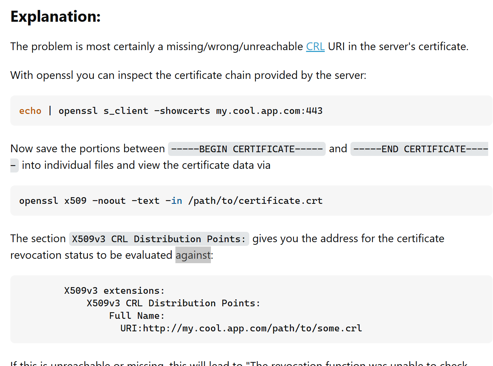
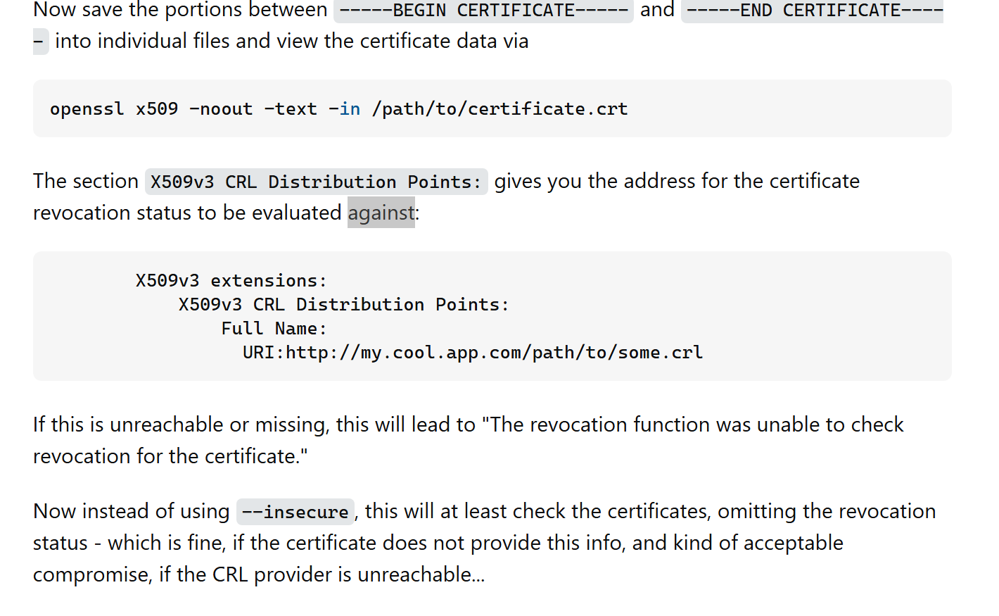

# Static PKI Role

## Role parameters

* `pki_preparation_home`: To document.
* `pki_ca_fqdn`: To document.
* `pki_ca_name`: To document.
* `pki_ca_validity_in_days`: To document.
* `pki_ca_passphrase`: To document.
* `force_regenerate_ca`: To document.
* `openbao_fqdn`: To document.
* `openbao_ip_address_1`: To document.
* `openbao_ip_address_2`: To document.
* `openbao_cert_validity_in_days`: To document.
* `force_regenerate_openbao_cert`: To document.

## ANNEX: The remaining issues

As I install the CA cert onto my windows machine, and then try and curl the OpenBAO service, I get this curl error:

```bash
Utilisateur@Utilisateur-PC MINGW64 ~
$ curl -i https://${OPENBAO_PRIVATE_IP_ADDR}/ui/ -d Sysdig -H "Host: openbao.pesto.io"
  % Total    % Received % Xferd  Average Speed   Time    Time     Time  Current
                                 Dload  Upload   Total   Spent    Left  Speed
  0     0    0     0    0     0      0      0 --:--:-- --:--:-- --:--:--     0
curl: (35) schannel: next InitializeSecurityContext failed: CRYPT_E_NO_REVOCATION_CHECK (0x80092012) - La fonction de r▒vocation n▒a pas pu v▒rifier la r▒vocation du certificat.
```

This is not a self signed certificate issue.

This is an issue, I think related to the CRL (Certificate Revocation List) service:

In https://superuser.com/questions/1800816/curl-35-schannel-next-initializesecuritycontext-failed-the-revocation-func I can read this very interesting explanation:






Now the question is: Ok, how can I fix this CRL missing issue?

I found one interesting ref: https://serverfault.com/questions/1147091/how-can-i-add-a-crl-to-an-existing-certificate-authority-certificate

I tested first:

```bash
export FIX_TEST_HOME='/etc/.pesto.pki/pestoplaform-ca.pesto.io/fix-crl-test1/'
mkdir -p ${FIX_TEST_HOME}


cp /etc/.pesto.pki/pestoplaform-ca.pesto.io/pestoplaform-ca.pesto.io.crt ${FIX_TEST_HOME}
cp /etc/.pesto.pki/pestoplaform-ca.pesto.io/pestoplaform-ca.pesto.io.key ${FIX_TEST_HOME}

cp /etc/.pesto.pki/pestoplaform-ca.pesto.io/pestoplaform-ca.pesto.io.srl ${FIX_TEST_HOME}

cd ${FIX_TEST_HOME}

cat <<EOF >./pestoplaform-ca.pesto.io.crl.conf
[ CA_default ]
crlnumber         = ./pestoplaform-ca.pesto.io.crlnumber
crl               = ./pestoplaform-ca.pesto.io.crl.pem
crl_extensions    = crl_ext
default_crl_days  = 365
EOF

echo '01' > ./pestoplaform-ca.pesto.io.crlnumber

openssl ca -config ./pestoplaform-ca.pesto.io.crl.conf \
-gencrl -crldays 365 -crl_hold holdInstructionCallIssuer

# above gives an error
# So I tweaked that the below works:
cat <<EOF >./pestoplaform-ca.pesto.io.crl.conf
[ ca ]
default_ca = myca
[ myca ]
dir = ./
crlDistributionPoints=URI:http://example.com/pestoplaform-ca.pesto.io.root.crl
database = \$dir/certindex
EOF
openssl ca -config ./pestoplaform-ca.pesto.io.crl.conf \
  -gencrl \
  -keyfile ./pestoplaform-ca.pesto.io.key \
  -cert ./pestoplaform-ca.pesto.io.crt \
  -out ./pestoplaform-ca.pesto.io.crl.pem

openssl crl -inform PEM -in ./pestoplaform-ca.pesto.io.crl.pem -outform DER -out ./pestoplaform-ca.pesto.io.root.crl

```


ANd then I found much more interesting, clearluy what I wanted: https://blog.didierstevens.com/2013/05/08/howto-make-your-own-cert-and-revocation-list-with-openssl/

There a good amount of work to do there, so see you next episode, but the main fix should be there.
